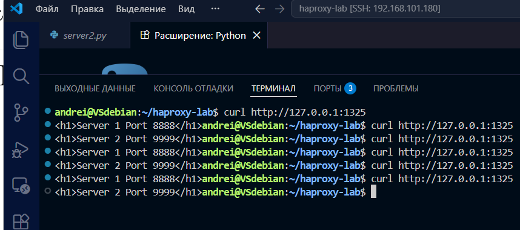
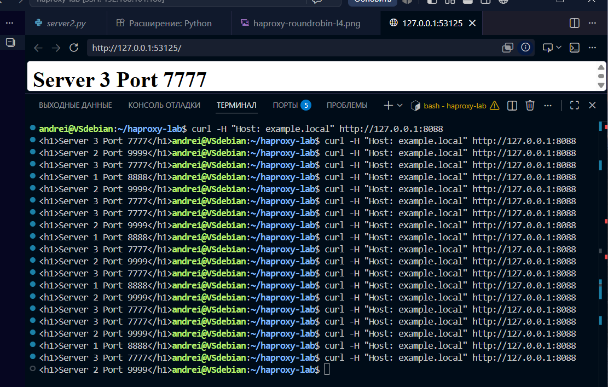
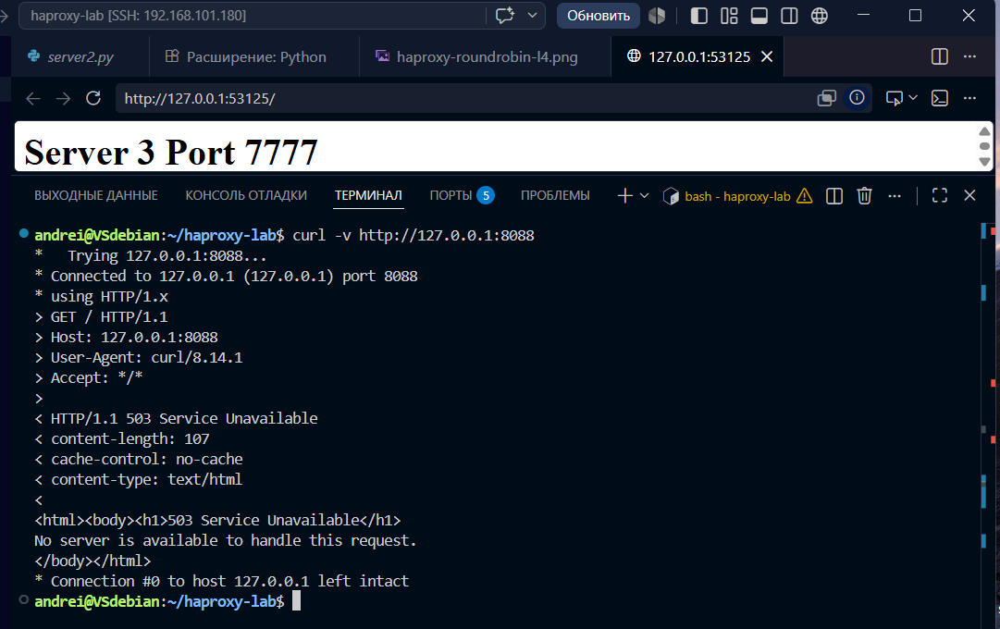
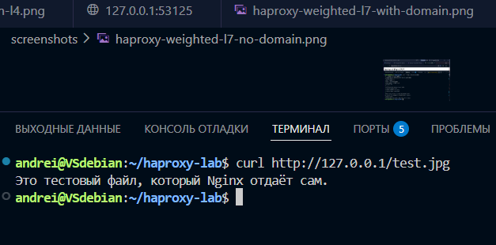
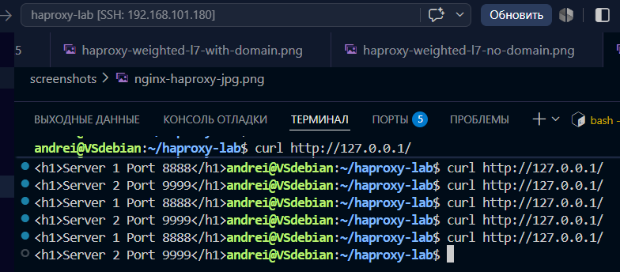
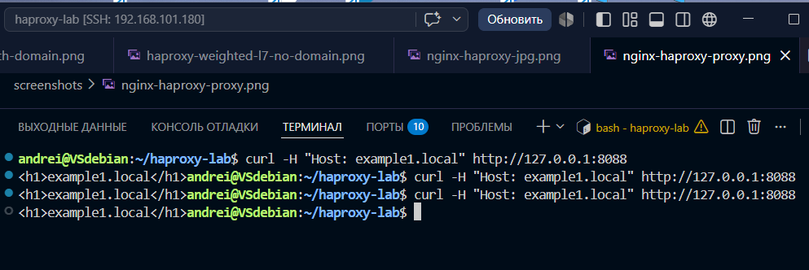
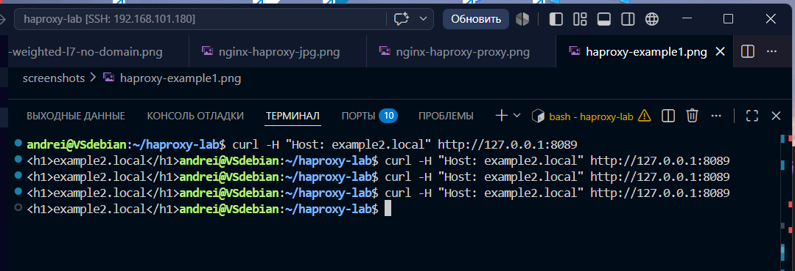

# Домашнее задание к занятию 2 «Кластеризация и балансировка нагрузки»

**Фамилия Имя:** Санакин Андрей

---

## Задание 1: HAProxy Round-robin L4 (TCP)

### Описание
Настроена балансировка TCP-трафика между двумя Python-серверами (порты 8888 и 9999) через HAProxy (порт 1325) по алгоритму round-robin.

### Скриншоты
- 

### Файлы
- [Конфиг HAProxy L4](configs/haproxy-roundrobin-l4.cfg)
- [Python-сервер 1](scripts/server1.py)
- [Python-сервер 2](scripts/server2.py)

---

## Задание 2: HAProxy Weighted Round Robin L7 (HTTP)

### Описание
Настроена балансировка HTTP-трафика между тремя Python-серверами с весами 2, 3, 4. Доступ только по домену `example.local`. Без домена — 503 ошибка.

### Скриншоты
- 
- 

### Файлы
- [Конфиг HAProxy L7](configs/haproxy-weighted-l7.cfg)
- [Python-сервер 3](scripts/server3.py)

---

## Задание 3*: HAProxy + Nginx

### Описание
Настроена связка: Nginx (порт 80) отдаёт `.jpg` файлы сам, остальные запросы проксирует на HAProxy (порт 8080), который балансирует между Python-серверами.

### Скриншоты
- 
- 

### Файлы
- [Конфиг Nginx](configs/nginx-haproxy.conf)
- [Конфиг HAProxy backend](configs/haproxy-nginx-backend.cfg)

---

## Задание 4*: Два фронтенда для разных доменов

### Описание
Настроены два фронтенда HAProxy:
- `example1.local` (порт 8088) → backend1 (серверы 9001, 9002)
- `example2.local` (порт 8089) → backend2 (серверы 9003, 9004)

### Скриншоты
- 
- 

### Файлы
- [Конфиг HAProxy два фронтенда](configs/haproxy-two-frontends.cfg)
- [Python-серверы example1](scripts/example1-server1.py)
- [Python-серверы example2](scripts/example2-server1.py)

---

## Параметры

| Параметр | Значение |
|----------|----------|
| HAProxy L4 | порт 1325 |
| HAProxy L7 | порт 8088 |
| HAProxy + Nginx | порт 8080 (backend) |
| example1.local | порт 8088 |
| example2.local | порт 8089 |
| Python-сервер 1 | порт 8888 |
| Python-сервер 2 | порт 9999 |
| Python-сервер 3 | порт 7777 |
| example1 серверы | порты 9001, 9002 |
| example2 серверы | порты 9003, 9004 |
